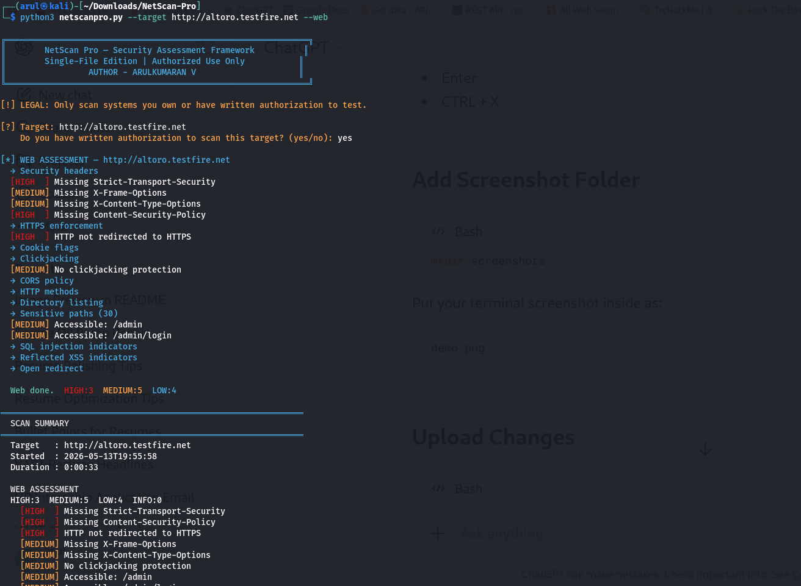

<h1 align="center">🛰️ NetScan Pro</h1>

<p align="center">
Professional Network & Web Security Assessment Framework
</p>

<p align="center">


</p>

---

> Professional penetration testing & web assessment tool built in Python for security researchers and VAPT learners.

---

# 🖥️ Preview

## Tool Interface



---

# ✨ Features

- ⚡ Multi-threaded Port Scanner
- 🔎 Banner Grabbing
- 🌐 Web Vulnerability Assessment
- 🛡️ Security Header Analysis
- 🍪 Cookie Security Checks
- 🔥 SQL Injection Detection Indicators
- 💉 Reflected XSS Detection
- 📂 Sensitive Path Discovery
- 📊 HTML Report Generation
- 🚨 Risk Classification System
- 📡 Open Port Enumeration
- 🔒 HTTPS Security Checks
- 🎯 CORS Misconfiguration Detection

---

# 🛠️ Tech Stack

| Component | Technology |
|------------|------------|
| Language | Python 3 |
| Networking | Socket Programming |
| Web Requests | Requests |
| CLI Styling | Colorama |
| Reporting | HTML/CSS |
| Platform | Kali Linux |

---

# 📦 Requirements

## System Requirements

- Kali Linux / Linux Distribution
- Python 3.8+
- Internet connection
- Git

---

## Python Libraries

| Library | Purpose |
|----------|----------|
| requests | HTTP Requests |
| colorama | Terminal Colors |

---

# 🚀 Installation & Setup

## Step 1 — Clone Repository

```bash
git clone https://github.com/0xarul/netscanpro.git
cd netscanpro
```

---

## Step 2 — Install Dependencies

```bash
pip install -r requirements.txt
```

---

## Step 3 — Run Port Scan

```bash
python3 netscanpro.py --target 127.0.0.1 --ports
```

---

## Step 4 — Run Web Assessment

```bash
python3 netscanpro.py --target https://example.com --web
```

---

## Step 5 — Full Security Assessment

```bash
python3 netscanpro.py --target 127.0.0.1 --full
```

---

# 🎯 Scan Capabilities

NetScan Pro can detect:

- Open Ports
- Service Information
- Banner Information
- Missing Security Headers
- Clickjacking Issues
- Insecure Cookies
- Dangerous HTTP Methods
- SQL Injection Indicators
- Reflected XSS
- Open Redirects
- Sensitive File Exposure
- Directory Listing

---

# 📊 Sample Output

## Port Scan

```bash
[*] PORT SCAN — 127.0.0.1

IP        : 127.0.0.1
Ports     : 1-1024
Threads   : 100

Done in 0.1s — 1 open port(s)

631/tcp  IPP
```

---

## Web Assessment

```bash
[HIGH] Missing Content-Security-Policy
[MEDIUM] Missing X-Frame-Options
[LOW] Server Header Disclosure
```

---

# 📁 Generated Report

NetScan Pro automatically generates professional HTML reports including:

- Severity Ratings
- Open Ports
- Web Findings
- Risk Summary
- Vulnerability Details

---

# ⚠️ Disclaimer

This tool is intended only for:

- Authorized Penetration Testing
- Security Research
- Educational Purposes

Do NOT scan targets without written permission.

---

# 👨‍💻 Author

**ARULKUMARAN V**

- GitHub: [@0xarul](https://github.com/0xarul)

---

# 📄 License

MIT License — see LICENSE file for details.
